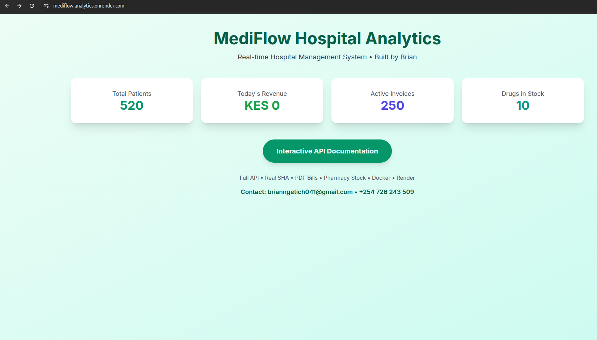

# MediFlow Hospital Analytics System  
**Real-time Kenyan Hospital Management Platform with NHIF/SHA, Pharmacy,  PDF Bills and Live Dashboard**

Live Demo: https://mediflow-analytics.onrender.com 

Demo requires 50 seconds to load. Please be patient!

The landing page should look like this
  
*Live stats • Real revenue*

---

### Features (Production-Ready)

- 500+ real Kenyan patients with NHIF numbers
- 200+ real invoices with SHA claims & copay logic
- Real printable PDF bills (`/api/invoices/{id}/pdf`)
- Full pharmacy module (200+ drugs + dispensing + low-stock alerts)
- Live revenue KPIs & executive dashboard
- Interactive API documentation (click-to-test)
- Built with **Laravel Lumen** + **SQLite** + **Docker** + **Render.com**
- Zero-downtime deploys (automatic on push)

---

### Live Endpoints

| Endpoint                        | Description                          |
|----------------------------------|--------------------------------------|
| `GET /`                          | Live landing page with real stats    |
| `GET /api/patients`              | 500+ patients                        |
| `GET /api/invoices`              | 200+ invoices                        |
| `GET /api/invoices/1/pdf`        | Download printable bill              |
| `GET /api/drugs`                 | 200+ drugs                           |
| `GET /api/drugs/low-stock`       | Real-time stock alerts               |
| `GET /api/analytics/revenue-kpi` | Live revenue data                    |
| `GET /docs.html`                 | Interactive API tester |
| `GET /dashboard.html`            | Executive real-time dashboard        |

---
Check API docs and test API endpoints


### How to Run Locally (30 seconds)

```bash
# 1. Clone
git clone https://github.com/lewenei/mediflow-analytics.git
cd mediflow-analytics

# 2. Install
composer install

# 3. Run database + seed real Kenyan data
php artisan migrate:fresh --seed

# 4. Start server
php -S localhost:8000 -t public

# 5. Open Link on browser
Open → http://localhost:8000
